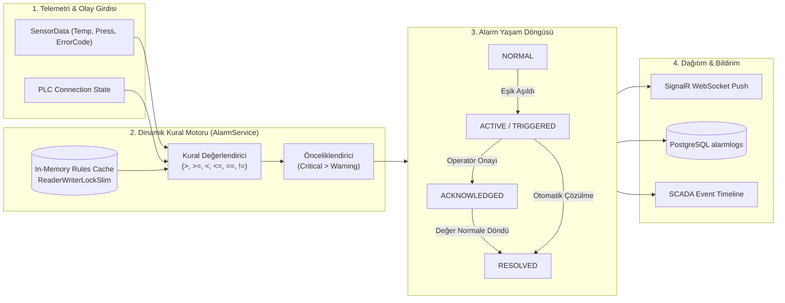
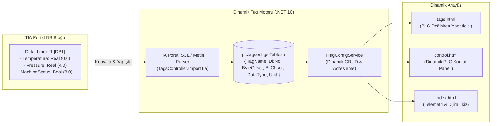

# 🏭 Industrial IoT & Digital Twin Platform — Siemens S7-1200

<div align="center">


[](https://dotnet.microsoft.com/)
[](https://docs.microsoft.com/dotnet/csharp/)
[](https://dotnet.microsoft.com/apps/aspnet)
[](https://www.postgresql.org/)
[](https://www.docker.com/)
[](https://xunit.net/)
[](LICENSE)

<p align="center">
  <b>Endüstri 4.0, SCADA ve MES standartlarında; Siemens S7-1200 PLC ile çift yönlü haberleşen, Çoklu Makine ve Fabrika Geneli Dijital İkiz (Multi-Machine / Industrial Historian) mimarisine sahip, dinamik TIA Portal Tag Motoruna (Dynamic Tag & DB Configurator), bellek içi önbellekli Konfigüre Edilebilir Kural Motoruna (Configurable Alarm Engine), çoklu veri tipi destekli PLC Komut Paneline, kural tabanlı Sağlık Skoru (Health Score) ve OEE motoruna sahip, JWT/RBAC korumalı kurumsal Dijital İkiz platformu.</b>
</p>

[Özellikler](#-temel-özellikler) • [Kural Motoru & Alarm Döngüsü](#-konfigüre-edilebilir-alarm-kural-motoru) • [TIA Portal Tag Motoru](#-dinamik-tia-portal-tag-motoru) • [Sistem Mimarisi](#-sistem-mimarisi) • [Sağlık Skoru & OEE](#-sağlık-skoru--oee-motoru) • [Güvenlik & Gözlemlenebilirlik](#-güvenlik-ve-gözlemlenebilirlik) • [Docker Kurulumu](#-docker-ile-hızlı-başlangıç) • [Test Paketi](#-test-paketi--doğrulama) • [CV & Portföy](#-cv--portföy-özeti)

</div>

---

## 🌟 Temel Özellikler

- **🏭 Çoklu Makine & Endüstriyel Historian Mimarisi (Multi-Machine Domain Model):** `Machine` ana tablosu (`Id`, `MachineCode`, `Name`, `Type`, `PlcIp`, `IsActive`) ile ilişkili `sensordata`, `alarmlogs`, `plctagconfigs`, `alarmrules` ve `systemeventlogs` hiyerarşisi; makineye özel telemetri filtreleme ve fabrika geneli birleşik Dijital İkiz (`PlantOverview`) görünümü.
- **🔌 Siemens S7-1200 Profinet/S7Comm Sürücüsü:** Gerçek endüstriyel donanım ve 5 deterministik arıza senaryosu içeren sanal simülasyon motoru arasında çalışma anında kesintisiz geçiş (**Seamless Simulation Fallback**).
- **⚙️ Konfigüre Edilebilir Alarm Kural Motoru (Configurable Rule Engine):** Kod içine gömülü if-else mantığı yerine veritabanı destekli, `ReaderWriterLockSlim` ile korunan yüksek performanslı bellek içi önbelleğe sahip dinamik kural motoru. `>`, `>=`, `<`, `<=`, `==`, `!=` operatörleri ve makineye özel eşik tanımları.
- **🎛️ Dinamik TIA Portal Tag & DB Konfigüratörü (Plug & Play):** Sabit kod bağımlılığını ortadan kaldıran; herhangi bir TIA Portal projesindeki DB blokları ve değişkenleri arayüzden yönetmeyi ve TIA Portal DB metnini yapıştırarak tek tıkla içe aktarmayı (Auto-Parser) sağlayan dinamik altyapı.
- **✍️ Çoklu Veri Tipi Destekli PLC Değişken Yazıcı (Tag Writer):** `REAL` (Float 32-bit), `BOOL` (Bit 1-bit), `INT` (Short 16-bit), `DINT` (Long 32-bit) ve `STRING` veri tiplerine göre dinamik adapte olan giriş bileşenleri ve komut denetim izi (Audit Trail) günlüğü.
- **🛡️ Dayanıklı Bağlantı Durum Makinesi (Connection Resilience & Auto-Reconnect):** Sahadaki ağ kopmalarına karşı **Exponential Backoff** ($T = \min(2^{\text{attempt}}, 30\text{s})$) stratejisiyle otomatik toparlanan durum makinesi (`Connected`, `Reconnecting`, `Connecting`, `Disconnecting`, `Disconnected`).
- **⚡ Düşük Gecikmeli Gerçek Zamanlı Veri Dağıtımı (SignalR Real-Time Push):** Geleneksel HTTP polling yükünü ortadan kaldıran, yeni PLC verisi okunduğunda istemcilere anında push yapan WebSocket mimarisi.
- **📊 PostgreSQL Zaman Serisi & EF Core 10:** `machines`, `sensordata`, `alarmlogs`, `systemeventlogs`, `alarmrules` ve `plctagconfigs` tabloları üzerinde B-Tree zaman indeksli yüksek performanslı veri kalıcılığı.
- **🚨 5 Aşamalı Akıllı Alarm Yaşam Döngüsü (Alarm Lifecycle):** $\text{NORMAL} \rightarrow \text{TRIGGERED} \rightarrow \text{ACTIVE} \rightarrow \text{ACKNOWLEDGED} \rightarrow \text{RESOLVED}$ akışı ve operatör onaylama sistemi.
- **📜 SCADA Olay Günlüğü & Timeline (Event & Audit Logs):** Sistem olaylarının (`PLC_CONNECTED`, `PLC_DISCONNECTED`, `MACHINE_STARTED`, `MACHINE_STOPPED`, `USER_LOGIN`) kategorize edilerek HMI Event Timeline bileşeninde canlı gösterimi.
- **🩺 Kural Tabanlı Sağlık Skoru (Health Scoring Engine):** Sıcaklık (%25), Basınç (%20), Bağlantı (%20) ve Alarmlar (%35) ağırlıklarıyla 0-100% arası ağırlıklı sağlık puanı (`HEALTHY`, `WARNING`, `DEGRADED`, `CRITICAL`).
- **🏆 OEE & Üretim Verimliliği Motoru:** Kullanılabilirlik (Availability), Performans (Performance) ve Kalite (Quality) bileşenleriyle dünya standardında OEE ve Çevrim Sayacı (Cycle Count).
- **🔐 JWT Kimlik Doğrulama & RBAC:** `Admin`, `Programmer`, `Operator`, `Viewer` rolleri, 401/403 koruması ve Swagger Bearer Auth desteği.
- **🔭 Gözlemlenebilirlik (Observability & Health Checks):** `/health` ve `/healthz` endpoint'leri üzerinden API bellek/uptime, PostgreSQL canlı bağlantı ve PLC bağlantı sağlık kontrolleri; mikro saniye hassasiyetli yapılandırılmış loglama (**Structured Logging**).
- **🐳 Docker & Docker Compose:** Backend, PostgreSQL ve opsiyonel pgAdmin servislerini tek komutla (`docker compose up -d`) ayağa kaldıran çok aşamalı (**Multi-Stage**) konteyner altyapısı.

---

## ⚙️ Konfigüre Edilebilir Alarm Kural Motoru

Sistem, alarmları statik koşullarla değil, çalışma anında konfigüre edilebilen kurallarla değerlendirir:



### 1. Alarm Kuralı Veri Modeli (`AlarmRule`):
| Alan | Tip | Açıklama |
| :--- | :--- | :--- |
| `MachineId` | `int?` | `null` ise fabrika genelinde, değer varsa sadece o makinede geçerli. |
| `Metric` | `string` | İzlenen parametre (`Temperature`, `Pressure`, `ErrorCode`, `MachineStatus`). |
| `Operator` | `ComparisonOperator` | Karşılaştırma tipi (`GreaterThan`, `LessThanOrEqual`, `Equal` vb.). |
| `Threshold` | `double` | Eşik değeri (Örn: 80.0°C, 8.5 bar). |
| `Severity` | `AlarmSeverity` | Alarm ciddiyet derecesi (`Warning`, `Critical`). |
| `AlarmType` | `string` | Alarm tanıtıcısı (`HIGH_TEMPERATURE`, `CRITICAL_PRESSURE`). |
| `Enabled` | `bool` | Kuralın aktif/pasif durumu. |

---

## 🎛️ Dinamik TIA Portal Tag Motoru

Proje, tek bir TIA Portal projesine veya sabit DB bloklarına bağımlı kalmayacak şekilde **Ignition SCADA / Siemens WinCC** mimarisi örnek alınarak dinamik tasarlanmıştır:



### Desteklenen PLC Veri Tipleri & Adresleme:
| Veri Tipi | S7 Bellek Tipi | Örnek Adres | UI Giriş Bileşeni | Açıklama |
| :--- | :--- | :--- | :--- | :--- |
| **`REAL`** | 32-bit Float | `DB1.DBD0` | Ondalıklı Sayı Kutusu (0.1 step) | Sıcaklık, basınç, seviye vb. analog sensörler. |
| **`BOOL`** | 1-bit Mantıksal | `DB1.DBX8.0` | Açık / Kapalı Toggle Butonları | Makine durumu, pompa/vana açma-kapama. |
| **`INT`** | 16-bit Short | `DB1.DBW10` | Tam Sayı Kutusu (1 step) | Çevrim kotası, devir hızı (RPM), reçete no. |
| **`DINT`** | 32-bit Integer | `DB1.DBD12` | Çift Tam Sayı Kutusu | Toplam üretim hedefi, zamanlayıcı limitleri. |
| **`STRING`** | Karakter Dizisi | `DB1.DBB20` | Metin Giriş Kutusu | Parti / Seri Numarası (Batch Code). |

---

## 🏛️ Sistem Mimarisi

```mermaid
flowchart TD
    subgraph Saha_Kati [1. Donanım & Simülasyon Katmanı]
        PLC["Siemens S7-1200 PLC\n(IP: 192.168.0.1:102 / DB1)"]
        MockPLC["Simulation Engine\n(NORMAL, OVERHEATING, HIGH_PRESSURE, MACHINE_STOP, PLC_FAILURE)"]
    end

    subgraph Backend_Kati [2. Backend & Engine Katmanı (.NET 10)]
        PlcMgr["IPlcConnectionManager\n(Exponential Backoff & State Machine)"]
        TagEng["ITagConfigService\n(Dinamik DB & Tag Yönetimi)"]
        Worker["Background Worker Service\n(2s Periyodik Örnekleme)"]
        AlarmEng["IAlarmService\n(Bellek İçi Kural Motoru & Lifecycle)"]
        EventEng["IEventLogService\n(Audit & System Event Logs)"]
        TwinEng["IDigitalTwinService\n(Health Scoring & OEE Engine)"]
        AuthEng["IJwtTokenService\n(JWT Bearer & RBAC)"]
        DBContext["IndustrialDbContext\n(EF Core 10.0 Npgsql)"]
        HubContext["IHubContext&lt;MonitoringHub&gt;\n(SignalR WebSocket)"]
    end

    subgraph Veri_Kati [3. Kalıcılık Katmanı]
        PG[("PostgreSQL 16\nmachines + sensordata + alarmlogs + alarmrules + systemeventlogs + plctagconfigs")]
    end

    subgraph Istemci_Kati [4. Operasyonel Arayüz]
        WebClient["Industrial Operations Dashboard\n- SVG Dijital İkiz Şeması\n- Canlı Telemetri & OEE Paneli\n- TIA Portal Tag Yöneticisi (tags.html)\n- PLC Komut & Yazma Paneli (control.html)\n- Aktif Alarmlar & SCADA Event Timeline"]
    end

    PLC -->|S7Comm Protocol| PlcMgr
    MockPLC -->|In-Memory| PlcMgr
    TagEng --> PlcMgr
    PlcMgr --> Worker
    Worker --> AlarmEng
    Worker --> EventEng
    Worker --> TwinEng
    Worker -->|Asenkron DB Log| DBContext
    DBContext --> PG
    Worker -->|Canlı PUSH| HubContext
    AlarmEng -->|Alarm Event| HubContext
    EventEng -->|System Event| HubContext
    TwinEng -->|Twin State| HubContext
    HubContext -->|Event-Driven WebSocket| WebClient
```

---

## 🩺 Sağlık Skoru & OEE Motoru

### 1. Kural Tabanlı Sağlık Skoru (Health Score)
$$\text{Health Score} = S_{\text{Sıcaklık}} (25p) + S_{\text{Basınç}} (20p) + S_{\text{Bağlantı}} (20p) + S_{\text{Alarm}} (35p)$$

| Skor Aralığı | Derece | Açıklama |
| :--- | :--- | :--- |
| **85% – 100%** | `HEALTHY` | Tüm parametreler ve bağlantı optimum seviyede. |
| **65% – 84%** | `WARNING` | Uyarı seviyesinde sıcaklık/basınç veya aktif alarm mevcut. |
| **40% – 64%** | `DEGRADED` | Birden fazla alarm veya bağlantı kesintisi/kopması. |
| **0% – 39%** | `CRITICAL` | Kritik sıcaklık/basınç eşiği aşıldı veya makine arızada. |

### 2. OEE (Overall Equipment Effectiveness)
$$\text{OEE} = \text{Availability} \times \text{Performance} \times \text{Quality}$$
- **Availability (Kullanılabilirlik):** Çalışma Süresi / Planlanan Üretim Süresi.
- **Performance (Performans):** Gerçek Üretim Hızı / İdeal Çevrim Hızı.
- **Quality (Kalite):** Sağlam Parça / Toplam Üretilen Parça (Fire Oranı Takibi).

---

## 🔐 Güvenlik ve Gözlemlenebilirlik

### 1. JWT & RBAC Rol Matrisi
| Rol | Kullanıcı | Yetkiler |
| :--- | :--- | :--- |
| **Admin** | `admin / admin123` | Tam sistem yetkisi, PLC komut gönderimi, tag yönetimi, alarm kuralları yönetimi, senaryo motoru kontrolü. |
| **Programmer** | `programmer / prog123` | PLC değişken yazma, TIA Portal DB içe aktarma, alarm kural tanımlama, simülasyon modu geçişi. |
| **Operator** | `operator / op123` | Dashboard izleme, alarm onaylama (`Acknowledge`), grafik filtreleme. |
| **Viewer** | `viewer / view123` | Salt okunur operasyonel izleme. |

### 2. Gözlemlenebilirlik & Health Checks (`GET /health`)
```json
{
  "status": "Healthy",
  "responseTimeMs": 18,
  "uptime": "1d 4h 12m 30s",
  "components": {
    "api": { "status": "Healthy", "version": "1.0.0", "framework": ".NET 10.0", "memoryUsageMb": 128.6 },
    "database": { "status": "Healthy", "provider": "PostgreSQL (Npgsql)" },
    "plc": { "status": "Healthy", "connectionState": "Connected", "scenario": "Normal" },
    "digitalTwin": { "operationalStatus": "Running", "healthScore": 100, "healthGrade": "Healthy" }
  }
}
```

---

## 🐳 Docker ile Hızlı Başlangıç

Projeyi ve PostgreSQL veritabanını tek komutla ayağa kaldırmak için:

```bash
# Projeyi ve veritabanını Docker ile başlat
docker compose up -d

# Logları takip et
docker compose logs -f

# Opsiyonel: pgAdmin ile birlikte başlat
docker compose --profile tools up -d
```
- **Web Dashboard:** [**http://localhost:5000**](http://localhost:5000)
- **Swagger API Dokümantasyonu:** [**http://localhost:5000/swagger**](http://localhost:5000/swagger)
- **Health Check Endpoint:** [**http://localhost:5000/health**](http://localhost:5000/health)

---

## 🧪 Test Paketi & Doğrulama

### 1. xUnit Birim ve Entegrasyon Testleri (65 Test)
```bash
dotnet test
```
```text
C:\Users\USER\source\Mini Project\IndustrialDataLogger\IndustrialDataLogger.Tests\bin\Debug\net10.0\IndustrialDataLogger.Tests.dll (.NETCoreApp,Version=v10.0) için test çalıştırması
Toplam 1 test dosyası belirtilen desenle eşleşti.

Başarılı!  - Başarısız:     0, Başarılı:    65, Atlanan:     0, Toplam:    65, Süre: 2 s - IndustrialDataLogger.Tests.dll (net10.0)
```

### 2. Otomatize E2E Test Paketi
```bash
powershell -ExecutionPolicy Bypass -File ".\IndustrialDataLogger\scratch\e2e_test.ps1"
```
```text
Running: 1. Health Check Endpoint (GET /health)... [PASS]
Running: 2. Swagger UI (GET /swagger/index.html)... [PASS]
Running: 3. Auth Login (POST /api/auth/login)... [PASS]
Running: 4. PLC Status API (GET /api/plc/status)... [PASS]
Running: 5. PLC Connect API (POST /api/Sensor/connect)... [PASS]
Running: 6. Simülasyon Senaryosu Ayarla (POST /api/Sensor/scenario)... [PASS]
Running: 7. Telemetri Okuma (GET /api/Sensor/latest)... [PASS]
Running: 8. SignalR Hub Negotiation... [PASS]
Running: 9. Digital Twin Consolidated State... [PASS]
Running: 10. Alarm Kuralları Listele... [PASS]
Running: 11. SCADA Event Timeline... [PASS]
Running: 12. PLC Disconnect Simülasyonu... [PASS]
Running: 13. PLC Reconnect Simülasyonu... [PASS]
==========================================================
 Test Sonucu: 13 Başarılı / 0 Başarısız
==========================================================
```

---

## 💼 CV & Portföy Özeti

Teknik mülakatlar ve özgeçmiş için doğrudan kullanılabilecek mühendislik maddeleri:

```markdown
- **Siemens S7-1200 Endüstriyel IoT & Dijital İkiz Platformu (.NET 10, C# 13, SignalR, PostgreSQL, Docker):**
  - Siemens S7-1200 PLC ile S7Comm/Profinet protokolü üzerinden çift yönlü haberleşen, sahadaki ağ kopmalarına karşı **Exponential Backoff State Machine** ($T = \min(2^{\text{attempt}}, 30\text{s})$) mimarisine sahip dayanıklı haberleşme altyapısı kurdu.
  - Kod içine gömülü statik eşikler yerine veritabanı destekli, `ReaderWriterLockSlim` ile korunan bellek içi önbelleğe sahip **Konfigüre Edilebilir Alarm Kural Motoru (Configurable Rule Engine)** ve 5 aşamalı alarm yaşam döngüsü ($\text{NORMAL} \rightarrow \text{TRIGGERED} \rightarrow \text{ACTIVE} \rightarrow \text{ACKNOWLEDGED} \rightarrow \text{RESOLVED}$) tasarladı.
  - TIA Portal projelerine göre dinamik şekil alan **Dinamik PLC Tag & DB Motoru (Tag Configurator & Auto-Parser)** ve `REAL`, `BOOL`, `INT`, `DINT`, `STRING` tiplerini destekleyen **Çoklu Veri Tipi Değişken Yazıcı** mimarisini kurdu.
  - Sıcaklık, basınç, bağlantı ve alarm metriklerini ağırlıklandıran **Kural Tabanlı Sağlık Skoru (Health Scoring)** ve **OEE (Overall Equipment Effectiveness)** üretim verimliliği motorunu tasarladı.
  - Düşük gecikmeli **SignalR WebSocket** veri boru hattı, **JWT & RBAC** yetkilendirmesi, **ASP.NET Core Health Checks** gözlemlenebilirlik altyapısı ve çok aşamalı **Docker Compose** ortamını kurdu.
  - xUnit ile 65 birim ve uçtan uca entegrasyon testini (%100 başarı) ve otomatize E2E senaryo doğrulama paketini geliştirdi.
```

---

<div align="center">
  Geliştirici: <b>Yasin Enes</b> • <a href="https://github.com/YasinnEnes">GitHub Profil</a>
</div>
