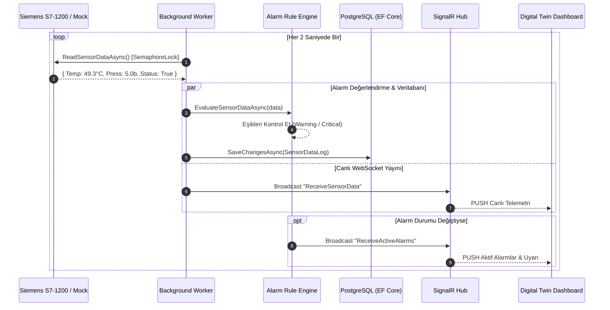

# 🏭 Industrial IoT & Digital Twin Platform — Siemens S7-1200

<div align="center">


[](https://dotnet.microsoft.com/)
[](https://docs.microsoft.com/dotnet/csharp/)
[](https://dotnet.microsoft.com/apps/aspnet)
[](https://www.postgresql.org/)
[](https://docs.microsoft.com/ef/core/)
[](https://www.siemens.com/)
[](https://github.com/S7NetPlus/s7netplus)
[](https://dotnet.microsoft.com/apps/aspnet/signalr)
[](LICENSE)

<p align="center">
  <b>Endüstri 4.0 ve SCADA standartlarında, Siemens S7-1200 PLC ile çift yönlü haberleşen, yüksek erişilebilirlikli (Self-Healing Auto-Reconnect), sıfır gecikmeli (SignalR WebSocket) ve kural motorlu (Alarm Engine) Dijital İkiz (Digital Twin) platformu.</b>
</p>

[Özellikler](#-temel-özellikler) • [Mimari](#-sistem-mimarisi) • [Veri Akışı](#-veri-akış-şeması) • [Tasarım Desenleri](#-tasarım-desenleri--mühendislik-kararları) • [Dizin Yapısı](#-proje-dizin-yapısı) • [API Dokümantasyonu](#-restful-api--signalr-spesifikasyonu) • [Kurulum](#-kurulum--hızlı-başlangıç) • [CV & Portföy](#-cv--portföy-özeti)

</div>

---

## 🌟 Temel Özellikler

- **🔌 Siemens S7-1200 Profinet/S7Comm Sürücüsü:** Gerçek donanım ve sanal simülasyon modları arasında anlık geçiş (Zero Downtime).
- **🛡️ Dayanıklı Bağlantı & Durum Makinesi (Auto-Reconnect):** Sahadaki ağ kesintilerine karşı otomatik toparlanan (Self-Healing) 5 kademeli bağlantı yönetimi (`Connected`, `Reconnecting`, `Connecting`, `Disconnected`, `Disconnecting`).
- **⚡ Sıfır Gecikmeli Telemetri (Zero-Polling SignalR):** Geleneksel HTTP polling yükünü ortadan kaldıran, yeni PLC verisi okunduğunda istemcilere anında push yapan WebSocket mimarisi.
- **📊 Optimize Zaman Serisi Depolama (PostgreSQL + EF Core 10):** `IX_sensordata_timestamp` B-Tree zaman indeksi ve `AsNoTracking()` ile optimize edilmiş yüksek hacimli telemetri sorgulama.
- **🚨 Akıllı Alarm & Teşhis Kural Motoru (Fault Detection Engine):**
  - Çok kademeli eşik denetimi (Kritik / Uyarı seviyeleri).
  - PLC kopma teşhisi (`PLC_CONNECTION_LOST`).
  - Parametreler normale döndüğünde otomatik çözülme (`Auto-Resolve`) ve operatör onaylama (`Acknowledge`).
- **🎛️ Canlı Dijital İkiz Arayüzü (SVG Visualizer):** Makinenin anlık mekanik dönüşünü, basınç akışını ve termal gradyanını yansıtan dinamik animasyonlu endüstriyel operatör paneli.

---

## 🏛️ Sistem Mimarisi

```mermaid
flowchart TD
    subgraph Saha_ve_Kontrol_Kati [Saha & Donanım Katmanı]
        PLC["Siemens S7-1200 PLC\n(IP: 192.168.0.1:102 / DB1)"]
        MockPLC["Sanal Simülasyon PLC\n(In-Memory Motor)"]
    end

    subgraph Backend_Kati [Backend & Engine Katmanı (.NET 10)]
        PlcMgr["IPlcConnectionManager\n(Auto-Reconnect & State Machine)"]
        Worker["Background Worker Service\n(2s Periyodik Örnekleme)"]
        AlarmEng["IAlarmService / Kural Motoru\n(Eşik Denetimi & Auto-Resolve)"]
        DBContext["IndustrialDbContext\n(EF Core 10.0)"]
        HubContext["IHubContext&lt;MonitoringHub&gt;\n(SignalR WebSocket)"]
    end

    subgraph Veri_Kati [Kalıcılık Katmanı]
        PG[("PostgreSQL IndustrialDataDB\nsensordata + alarmlogs")]
    end

    subgraph Istemci_Kati [Kullanıcı & Operatör Arayüzü]
        WebClient["Modern Dijital İkiz Dashboard\n- Canlı SVG Makine Temsili\n- Chart.js Zaman Serisi\n- Aktif Alarm & Teşhis Paneli"]
    end

    PLC -->|S7Comm Protocol| PlcMgr
    MockPLC -->|In-Memory| PlcMgr
    PlcMgr --> Worker
    Worker --> AlarmEng
    Worker -->|Asenkron DB Log| DBContext
    DBContext --> PG
    Worker -->|Canlı PUSH| HubContext
    AlarmEng -->|Alarm Event| HubContext
    HubContext -->|Zero-Polling WebSocket| WebClient
```

---

## 🔄 Veri Akış Şeması



---

## 🧠 Tasarım Desenleri & Mühendislik Kararları

| Tasarım Deseni / Konsept | Uygulama Yeri | Sağladığı Fayda |
|---|---|---|
| **State Machine Pattern** | `PlcConnectionManager` | PLC bağlantı geçişlerini (`Connecting`, `Connected`, `Reconnecting`, vb.) kontrollü yönetir ve yarış durumlarını (Race Condition) önler. |
| **Hosted Service (Worker)** | `Worker.cs` | Arka planda non-blocking şekilde periyodik veri okur, `CancellationToken` ile güvenli kapatma sağlar. |
| **Thread-Safe Concurrency** | `SemaphoreSlim(1,1)` | Worker okuma yaparken Web API komutlarının soketi aynı anda kullanmasını engelleyerek veri bozulmasını önler. |
| **Rule Engine Pattern** | `AlarmService.cs` | Veri akışını eşik kurallarıyla kıyaslar, alarm üretir ve değer normale döndüğünde otomatik kapatır (`Auto-Resolve`). |
| **Observer / Push Pattern** | `MonitoringHub (SignalR)` | HTTP Polling maliyetini sıfırlayarak sunucudan bağlı istemcilere milisaniyelik veri akışı sağlar. |
| **Repository & Unit of Work** | `IndustrialDbContext` | Zaman serisi verilerini B-Tree indeksleri ve `AsNoTracking()` ile bellek dostu şekilde yönetir. |

---

## 📁 Proje Dizin Yapısı

```
IndustrialDataLogger/
├── .github/
│   └── workflows/
│       └── ci.yml                     # Otomatik derleme ve test doğrulama (CI)
├── Controllers/
│   ├── AlarmsController.cs            # Aktif ve geçmiş alarm REST uçları
│   ├── DigitalTwinController.cs       # Konsolide Dijital İkiz durum API'si
│   ├── PlcStatusController.cs         # PLC sağlık ve bağlantı durumu API'si
│   └── SensorController.cs            # Sensör geçmişi, istatistik ve mod yönetimi
├── Dashboard/
│   ├── index.html                     # Dijital İkiz Operatör Paneli & Grafikler
│   ├── control.html                   # PLC Komut ve Çift Yönlü Kontrol Paneli
│   └── login.html                     # Kullanıcı giriş ve rol yetkilendirme
├── Data/
│   └── IndustrialDbContext.cs         # EF Core PostgreSQL veritabanı bağlamı
├── Enums/
│   ├── AlarmSeverity.cs               # Info, Warning, Critical seviyeleri
│   ├── AlarmStatus.cs                 # Active, Resolved, Acknowledged durumları
│   └── PlcConnectionState.cs          # 5 kademeli bağlantı durumları
├── Hubs/
│   └── MonitoringHub.cs               # SignalR WebSocket Hub kanalı
├── Models/
│   ├── DTOs/
│   │   └── DigitalTwinStateDto.cs     # Bütünleşik Dijital İkiz veri transfer modeli
│   └── Entities/
│       ├── AlarmLog.cs                # Alarm olay günlüğü veritabanı varlığı
│       └── SensorDataLog.cs           # Sensör zaman serisi veritabanı varlığı
├── Services/
│   ├── AlarmService.cs                # Alarm ve teşhis kural motoru
│   ├── HybridPlcService.cs            # Gerçek PLC ve Simülasyon köprü servisi
│   ├── MockPlcService.cs              # Sanal matematiksel PLC simülatörü
│   ├── PlcConnectionManager.cs        # Auto-Reconnect durum makinesi yöneticisi
│   └── PlcService.cs                  # S7.Net+ Siemens Profinet sürücüsü
├── appsettings.json                   # PostgreSQL ve PLC yapılandırma ayarları
├── Program.cs                         # Servis kayıtları, CORS, SignalR & Middleware
└── README.md                          # Proje dokümantasyonu
```

---

## 📡 RESTful API & SignalR Spesifikasyonu

### RESTful Uç Noktalar

| Metot | Endpoint | Açıklama |
|---|---|---|
| `GET` | `/api/digitaltwin/state` | Tüm telemetri, bağlantı, istatistik ve alarmları içeren birleşik Dijital İkiz durumu. |
| `GET` | `/api/Sensor/latest` | En son okunan anlık sensör telemetrisi. |
| `GET` | `/api/Sensor/history` | Filtrelenebilir (`startDate`, `endDate`, `machineStatus`, `limit`, `skip`) geçmiş veriler. |
| `GET` | `/api/Sensor/history/stats` | Min, Max, Ortalama ve Makine Çalışma Oranı istatistik özeti. |
| `POST` | `/api/Sensor/connect` | PLC / Simülasyon bağlantısını başlatır. |
| `POST` | `/api/Sensor/disconnect` | PLC bağlantısını güvenli kapatır. |
| `POST` | `/api/Sensor/mode` | Simülasyon ile Gerçek PLC arasında dinamik mod değişimi yapar. |
| `GET` | `/api/plc/status` | PLC bağlantı sağlığı (`state`, `isConnected`). |
| `GET` | `/api/alarms/active` | Anlık aktif alarmların listesi. |
| `GET` | `/api/alarms/history` | Geçmiş alarm olay günlüğü. |
| `POST` | `/api/alarms/{id}/acknowledge` | Alarmı operatör tarafından onaylar. |

### SignalR WebSocket Olayları (`/sensorHub`)

- `ReceiveSensorData` ➔ `{ temperature, pressure, machineStatus, errorCode, timestamp }`
- `ReceivePlcStatus` ➔ `{ state, isConnected }`
- `ReceiveActiveAlarms` ➔ `List<AlarmLog>`

---

## 🛠️ Kurulum & Hızlı Başlangıç

### Gereksinimler
- [.NET 10 SDK](https://dotnet.microsoft.com/download/dotnet/10.0)
- [PostgreSQL](https://www.postgresql.org/) (veya Docker PostgreSQL)

### 1. Depoyu Klonlayın
```bash
git clone https://github.com/YasinnEnes/IndustrialDataLogger.git
cd IndustrialDataLogger
```

### 2. Veritabanı Yapılandırması
`IndustrialDataLogger/appsettings.json` dosyasında PostgreSQL bağlantınızı düzenleyin:
```json
"ConnectionStrings": {
  "PostgreSql": "Host=localhost;Port=5432;Database=IndustrialDataDB;Username=postgres;Password=1234"
}
```

### 3. Projeyi Derleyin ve Çalıştırın
```bash
dotnet restore
dotnet build
dotnet run --project IndustrialDataLogger
```

### 4. Tarayıcıda İnceleyin
- **Dijital İkiz Dashboard:** [http://localhost:5000](http://localhost:5000)
- **Swagger API Dokümantasyonu:** [http://localhost:5000/swagger](http://localhost:5000/swagger)

---

## 💼 CV & Portföy Özeti

> **Siemens S7-1200 PLC & .NET 10 Tabanlı Endüstriyel Dijital İkiz (Digital Twin) Platformu**
> - **Endüstriyel Protokol & Otomasyon:** Siemens S7-1200 PLC ile S7Comm/Profinet üzerinden thread-safe (`SemaphoreSlim`) çift yönlü haberleşme sağlayan C# sürücüsü geliştirildi.
> - **Yüksek Erişilebilirlik (Auto-Reconnect):** Sahadaki ağ kesintilerine karşı insan müdahalesine gerek kalmadan otomatik toparlanan (Self-Healing) durum makinesi (State Machine) tasarlandı.
> - **Zaman Serisi & Performans:** PostgreSQL ve EF Core üzerinde B-Tree zaman indeksleri ve `AsNoTracking` optimizasyonlarıyla yüksek hacimli telemetri kayıt ve analitik sorgu altyapısı kuruldu.
> - **Gerçek Zamanlı Mimari:** ASP.NET Core SignalR ile HTTP polling yükü ortadan kaldırılarak sıfır gecikmeli WebSocket veri yayını sağlandı.
> - **Kural Motoru & Karar Destek:** Kritik sıcaklık, basınç ve bağlantı kesintilerine karşı otomatik alarm üreten ve çözen (Auto-Resolve) endüstriyel kural motoru geliştirildi.
> - **Dijital İkiz Arayüzü:** Sahadaki makinenin mekanik ve termal durumunu yansıtan canlı animasyonlu SVG Dijital İkiz paneli inşa edildi.

---

## 📄 Lisans

Bu proje [MIT Lisansı](LICENSE) kapsamında lisanslanmıştır.
